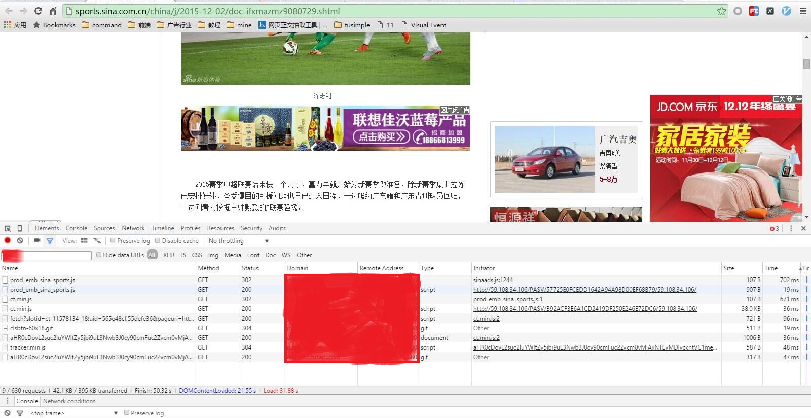

Internet Ads
=============

知识图谱标签：在线广告行业、JavaScript（前端/全栈）技术

## 前言 ##

在线广告，无外乎游走于 AUC (广告主、用户、媒体方)之间。A至极为4A，U至极为精准，C至极则原生。

- 目标：探索不同在线广告实现方案，推动互联网广告向智能、原生、精准的跨屏方向发展，追求实现一套优良的 Web 生态的广告投放实践方案
- 面向读者人群：面向互联网公司的商业产品技术实践者

## 行业 ##

### 行业动态 ###

- [营销技术生态图谱（2015）](http://chiefmartec.com/2015/01/marketing-technology-landscape-supergraphic-2015/)
- [RTBChina：中国程序化技术生态圈](http://www.rtbchina.com/china-display-ad-tech-ecosystem)

### 行业标准 ###

- [中国移动互联网广告标准（互联网数字广告基础标准、移动互联网广告监测标准、移动系统对接标准）](http://iac-i.org/standards_of_chinese_mobile_internet_advertisement.html)
- [互联网广告署IAB](https://www.iab.net/)

## 竞品 ##

### 精准广告 ###

- Tanx
- [京准通](http://jzt.jd.com/gw/)

### 原生广告（Native Advertising） ###

#### 分类 ####

- 搜索广告，作为**明确用户意图**的**原生广告**，完全开放进行RTB，很难控制**付费结果的相关性**。这种情况，采用单个技术能力较强原生广告网络（也可以自营）方式比较可行。
- 信息流广告，用户意图不明确、不要求广告依此触发，可考虑用程序化交易的方式运营。

#### 要点 ####

- 表现原生与意图原生
- 植入式原生（媒体一定程度参与，大量分行业、结构化广告信息，成规模的付费内容库）

#### 竞品名单 ####

- Google Admob
- InMobi 投放广告创意
- OutBrain 投放付费内容（即广告主的内容）
- [百度图＋](http://imageplus.baidu.com/)：根据网站图片匹配相关推广，并展示在图片上的变现方案。有三种展示形式，贴片样式、右上展开样式、Icon浮层样式
- [GumGum](http://gumgum.com/)：图片内嵌广告公司。通过智能识别图片内容，为图片添加对应的悬浮式广告信息。2014年针对视频推出屏幕嵌入式广告。产品分 IN-IMAGE和 IN-SCREEN。GumGum的盈利机制是这样的，GumGum首先和图片发布者达成协议，准许GumGum使用他们的图片并开辟广告位。GumGum再向有兴趣的广告商推销这些图片上的广告位。接下来的事就和互联网广告业的通行做法类似，GumGum与图片发布者对浏览并点击广告产生的收入进行分成。
- [Cortica](http://cortica.com/demo_new.html):与Gumgum类似。
- [Kiosked](http://www.kiosked.com/)：芬兰的一个“内容广告平台”公司，几乎可以让用户购买他们在网络上看到的任何东西。通过使用视觉识别软件，它可以匹配 YouTube 视频、网页或网站其他地方出现的物品，并可以让用户购买它们——但前提是该商品品牌参与到 Kiosked 的项目。
- [ThinkLink](https://www.thinglink.com/)：通过将一个有搜索、评论及社会连接的导航界面放入图片从而改变了人们与图片互动的方式。ThingLink技术可以让企业及供应商在图片中标记产品，从而引导消费者购买，ThingLink表示图片中的平均点击率大概在1.5%到5%之间，还能让厂商追踪标记的图片是如何在网络上被传播分享的。
- [Imonomy](http://imonomy.com/products/)
- [Popmarker](http://www.popmarker.com/products)
- [Insight Image](http://insightimage.com/)
- [Kaptur](http://kaptur.co/embedding-images-contextual-ad-delivery-model/)

## 其它 ##

### ISP强投 ###

2015年12月，发现使用 方正宽带（北京） 时总有个奇怪的 http 请求到指定 ip （ PC 是59.108.34.106；移动设备是 114.215.114.158），规律是拦截 js 请求，之后再请求原始的 js 。同时如果是 PC 网页则右下角浮窗，如果是手机网页则底部出现浮动通栏。时间有限，在此只扒了一点 js 分享。源码见 founderbn ， 效果如图右下角

### Google AdSense ###

- [如何修改自适应广告代码](https://support.google.com/adsense/answer/6307124)